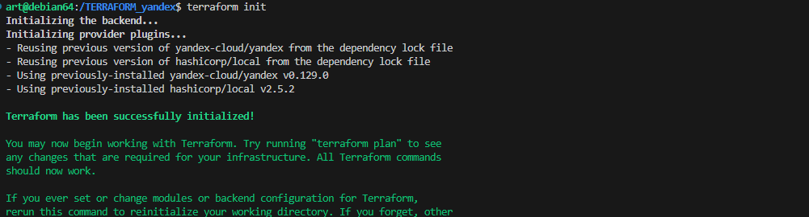
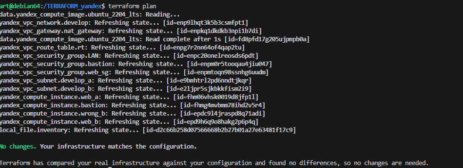
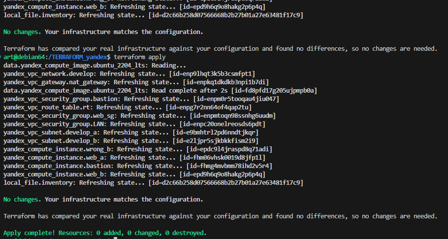
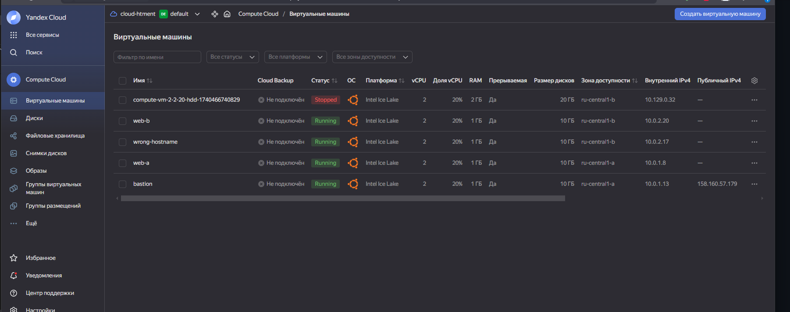
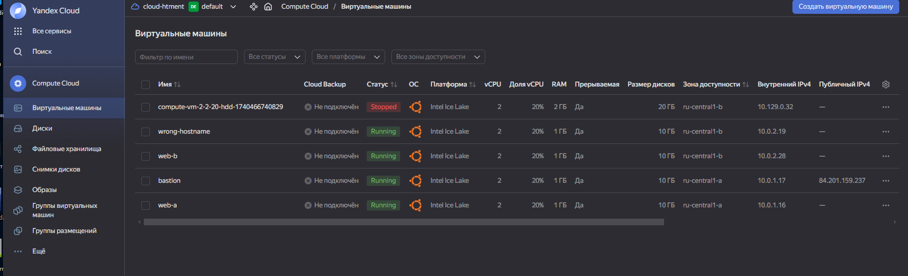
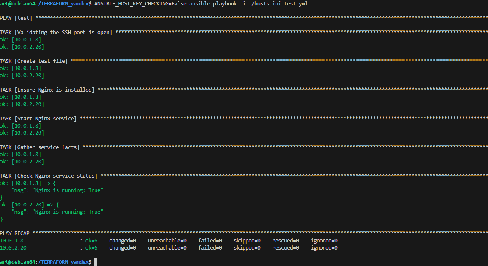
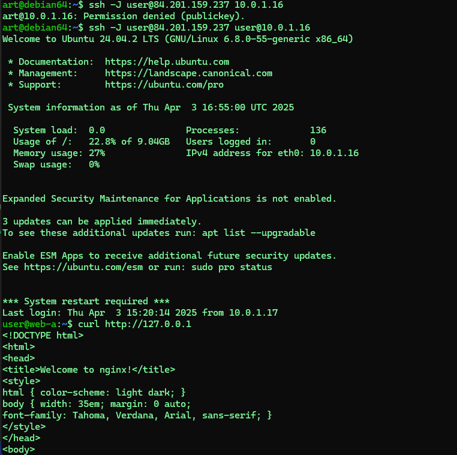

### Задание 1 

Повторить демонстрацию лекции(развернуть vpc, 2 веб сервера, бастион сервер)


**ОТВЕТ**
КОД по ссылке:
[https://github.com/htment/HOMEWORK_Terraform_yandex](https://github.com/htment/HOMEWORK_Terraform_yandex)

1. Скачиваем провайдер
```terraform init```

2. Смотрим изменения
   ```terraform plan```

3. Применяем
  ```terraform apply```


4. Смотрим в яндекс 



### Задание 2 

С помощью ansible подключиться к web-a и web-b , установить на них nginx.(написать нужный ansible playbook)


Провести тестирование и приложить скриншоты развернутых в облаке ВМ, успешно отработавшего ansible playbook. 


Заходим на хост и проверяем
